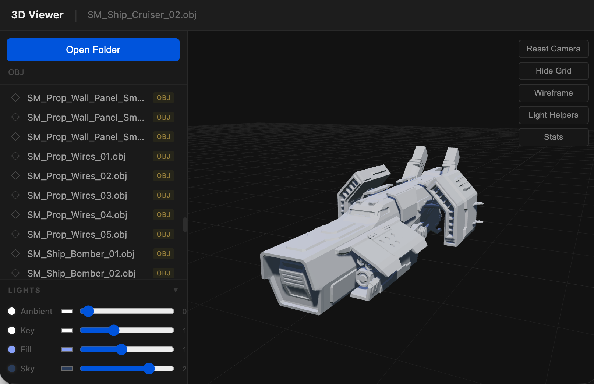

A browser-based 3D model viewer built with [Three.js](https://threejs.org/). Open a local folder, browse your models, and inspect them interactively — no server or build step required.

## Features

- **Format support** — GLB, GLTF, OBJ (with MTL), FBX, and STL
- **Folder browser** — navigate directories and subfolders directly from the browser using the File System Access API
- **Texture resolution** — textures stored in subdirectories (e.g. `textures/`, `maps/`) are automatically discovered and applied
- **Orbit controls** — rotate, pan, and zoom with mouse or touch
- **Animation playback** — play, pause, stop, scrub, and switch between animation clips; adjustable playback speed
- **Lighting panel** — toggle and adjust four independent lights (Ambient, Key, Fill, Sky) with color pickers and intensity sliders
- **Viewer controls** — reset camera, toggle grid, wireframe mode, light helpers, and a mesh stats HUD
- **Shadow mapping** — PCF soft shadows via a directional key light

## Usage

Open `index.html` directly in a Chromium-based browser (Chrome or Edge). Firefox is not supported because the File System Access API (`showDirectoryPicker`) is required.

1. Click **Open Folder** and select a directory containing 3D models.
2. Click any model in the sidebar to load it.
3. Use the viewer controls in the top-right corner to adjust the view.
4. If the model has animations, the animation panel appears at the bottom.

## Dependencies

All dependencies are loaded from CDN at runtime — no `npm install` needed.

| Package | Version | Purpose |
|---|---|---|
| [three](https://cdn.jsdelivr.net/npm/three@0.170.0/) | 0.170.0 | 3D rendering engine |
| [fflate](https://cdn.jsdelivr.net/npm/fflate@0.8.2/) | 0.8.2 | Decompression (used by GLTFLoader) |

## Browser Compatibility

Requires a browser that supports the [File System Access API](https://developer.mozilla.org/en-US/docs/Web/API/File_System_Access_API). Chrome 86+ and Edge 86+ are recommended.
